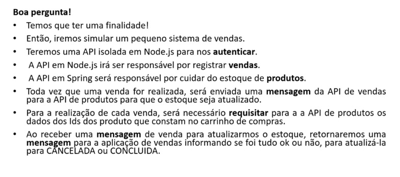
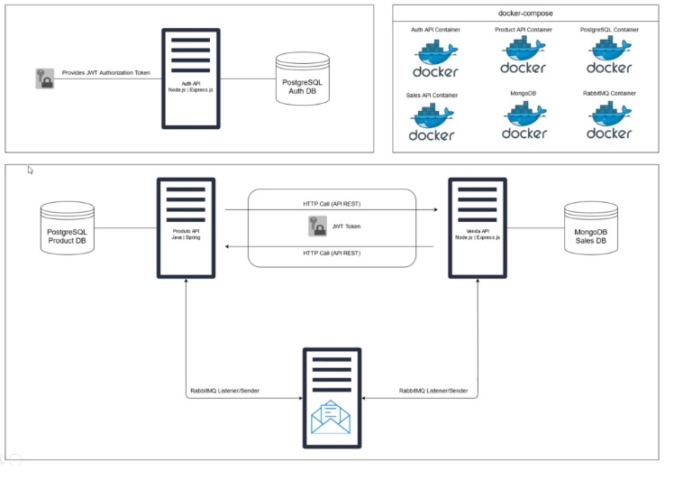

# ead_java_udemy_comunicacao-entre-microsservicos

> Projeto referente a [este](https://www.udemy.com/course/comunicacao-entre-microsservicos/) curso.





## Desenvolvimento

1. Suba o ambiente
    ```sh
    docker-compose up -d
    ```

    > Pare o ambiente com ``docker-compose down``
